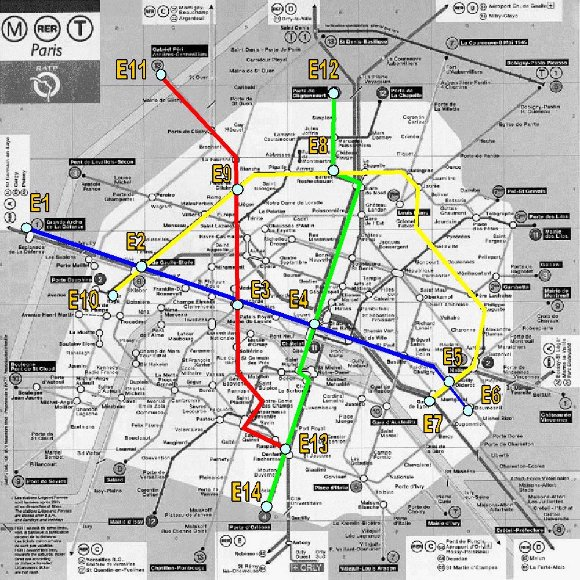

**A\* - Problema do metrô de Paris**

Suponha que queremos construir um sistema para auxiliar um usuário do metrô de Paris a saber o **trajeto mais rápido** entre a estação onde ele se encontra e a estação de destino. O usuário tem um painel com o mapa, podendo selecionar a sua estação de destino. O sistema então acende as luzes sobre o mapa mostrando o melhor trajeto a seguir (em termos de quais estações ele vai atravessar e quais as conexões mais rápidas a fazer – se for o caso). Para facilitar a vida, consideramos apenas 4 linhas do metrô.

Considere que:

- a distância em linha reta entre duas estações quaisquer é dada pela tabela 1 e a distância real é dada pela tabela 2.
- a velocidade média de um trem é de 30km/h;
- o tempo gasto para trocar de linha dentro de mesma estação (fazer baldeação ) é de 4 minutos.

Exemplo de Estado = estação 5 na linha azul             **Implemente uma solução para esse problema usando o A\***

**\*\*\*\*\*\*\*\*\*\*\*\*\*\*\*\*\*\*\*\*\*\*\*\*\*\*\*\*\*\*\*\*\*\*\*\*\*\*\*\*\*\*\*\*\*\*\*\*\*\*\*\*\*\*\*\*\*\*\*\*\*\*\*\*\*\*\*\*\*\*\* Dados do problema:**

**Tabela1:** distâncias **diretas** entre as estações do Metrô de Paris.

||**E1**|**E2**|**E3**|**E4**|**E5**|**E6**|**E7**|**E8**|**E9**|**E10**|**E11**|**E12**|**E13**|**E14**|
| :- | - | - | - | - | - | - | - | - | - | - | - | - | - | - |
|**E1**|-|10|18,5|24,8|36,4|38,8|35,8|25,4|17,6|9,1|16,7|27,3|27,6|29,8|
|**E2**||-|8,5|14,8|26,6|29,1|26,1|17,3|10|3,5|15,5|20,9|19,1|21,8|
|**E3**|||-|6,3|18,2|20,6|17,6|13,6|9,4|10,3|19,5|19,1|12,1|16,6|
|**E4**||||-|12|14,4|11,5|12,4|12,6|16,7|23,6|18,6|10,6|15,4|
|**E5**|||||-|3|2,4|19,4|23,3|28,2|34,2|24,8|14,5|17,9|
|**E6**||||||-|3,3|22,3|25,7|30,3|36,7|27,6|15,2|18,2|
|**E7**|||||||-|20|23|27,3|34,2|25,7|12,4|15,6|
|**E8**||||||||-|8,2|20,3|16,1|6,4|22,7|27,6|
|**E9**|||||||||-|13,5|11,2|10,9|21,2|26,6|
|**E10**||||||||||-|17,6|24,2|18,7|21,2|
|**E11**|||||||||||-|14,2|31,5|35,5|
|**E12**||||||||||||-|28,8|33,6|
|**E13**|||||||||||||-|5,1|
|**E14**||||||||||||||-|

**Tabela2:** distâncias **reais** entre as estações do Metrô de Paris.

||**E1**|**E2**|**E3**|**E4**|**E5**|**E6**|**E7**|**E8**|**E9**|**E10**|**E11**|**E12**|**E13**|**E14**|
| :- | - | - | - | - | - | - | - | - | - | - | - | - | - | - |
|**E1**|-|10|||||||||||||
|**E2**||-|8,5||||||10|3,5|||||
|**E3**|||-|6,3|||||9,4||||18,7||
|**E4**||||-|13|||15,3|||||12,8||
|**E5**|||||-|3|2,4|30|||||||
|**E6**||||||-|||||||||
|**E7**|||||||-||||||||
|**E8**||||||||-|9,6|||6,4|||
|**E9**|||||||||-||12,2||||
|**E10**||||||||||-|||||
|**E11**|||||||||||-||||
|**E12**||||||||||||-|||
|**E13**|||||||||||||-|5,1|
|**E14**||||||||||||||-|

**b**

**n Mapa do metrô de Paris.**

